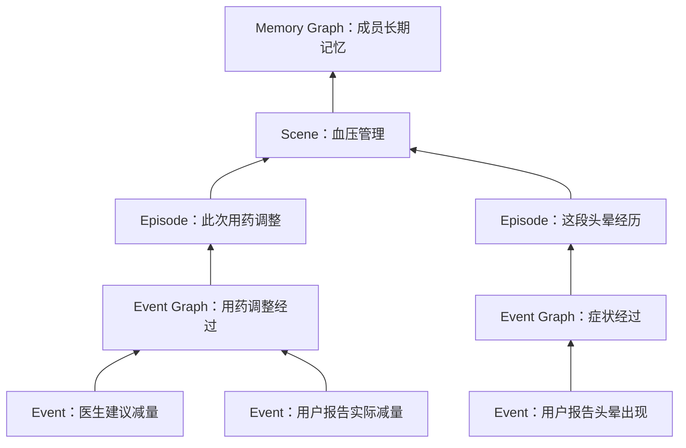

# 基于 SAG 的长期记忆与认知架构

> 文档状态：未来愿景，尚未纳入当前执行。
>
> 负责：长期记忆的对象、关系、状态、追加机制、形成过程、查询方式与验证要求。
>
> 当前基础：[技术架构总览](../当前执行/架构/技术架构总览.md)、[智能体运行时](../当前执行/架构/智能体运行时.md)、[当前术语表](../当前执行/术语表.md)。

## 目标与总体结构

Serenita 的长期记忆将医疗报告、健康日记、用药记录、身体指标、会话和附件连接起来，使智能体能够理解一个人的健康经历：发生过什么，这些事情怎样关联，某段时期是什么状态，已有认识依据什么，以及哪些问题仍然没有答案。

长期记忆同时支持主动推荐。在用户授权的持续关注范围内，智能体可以因新资料到达或定期检查发起记忆召回，发现用户尚未逐项提出的变化、问题和后续安排，核对依据后提出建议，并结合用户反馈与实际结果继续判断。

记忆同时保留经历的变化和认识的变化。新资料中的事实与后续变化各自追加为 Event，并根据依据建立关系、形成状态与认识。系统需要同时回答“根据当前资料，事情怎样发生”和“当时系统掌握了什么”。

整个模块采用 **Append-only**：所有已经保存的记忆、关系、状态和派生内容始终保持初次提交时的内容，并完整保留。新资料与新判断持续追加，当前状态由完整记录中的有效关系计算得到。

| 部分            | 职责                                                      |
| ------------- | ------------------------------------------------------- |
| SAG | 提供 Event Description 语义向量召回与 Entity 检索两路入口，经关联扩展和联合选择定位证据 |
| 长期记忆          | 组织 Event、Episode、Scene 和状态，追加有依据的认识及其演化关系               |
| Agent Harness | 根据用户目标、Skill 和 Observation 选择能力、继续取证、询问用户或形成最终回答        |

## 固定术语

架构中的关键对象与状态使用本文定义的固定英文名称，中文用于解释含义。正文、图示和算法说明采用相同名称；模块名称“长期记忆与认知架构”保留中文。Skill、Observation、Schema 及医疗业务名称沿用[当前术语表](../当前执行/术语表.md)。

### 从事件到长期记忆

| 对象                 | 含义                              | 与其他对象的关系                                                         |
| ------------------ | ------------------------------- | ---------------------------------------------------------------- |
| Source Statement   | 某份资料作出的陈述，保留主体、时间、内容角色与原文位置     | 是事件判断及派生认识的可追溯依据                                                 |
| Event Description  | 对资料中一段语义内容形成的索引描述               | 连接 Source Statement、Entity 和原文，供 SAG 定位与扩展                       |
| Entity             | 成员、药品、药物概念、检验指标、机构等对象或概念        | 使用正式标识及有依据的别名连接资料                                                |
| Event              | 根据资料追加保存的不可变事件，包含新事实及后续变化的表达    | 每次追加具有独立标识并关联 Source Statement；多个 Event 可以描述同一次现实经历，其联系由有依据的关系表达 |
| Episode            | 一件有明确边界的持续健康问题、治疗过程或具体安排        | 使用 Episode Definition 确定范围，以 Event Graph 组织经历                    |
| Episode Definition | Episode 的主体、具体问题、关键对象、时间依据及归属条件 | 用于判断新 Event 是否属于该事项                                              |
| Event Graph        | 一个 Episode 内部的 Event 及演化关系      | 表达事件链条、分支、交叉和部分时间顺序                                              |
| Scene              | 围绕共同健康问题或时期组织的长期主题，如血压管理        | 关联多个 Episode，以及相关轨迹和未归属资料                                        |
| Trajectory         | 某类症状、用药、指标或就诊经历的长期轨迹            | 支持跨时期展开、比较及断点定位                                                  |
| Memory Graph       | 成员长期记忆的整体关系结构                   | 连接上述对象、状态、认识、问题及原始依据                                             |
|                    |                                 |                                                                  |

Event Graph 通过 Event 及其关系表达一个 Episode 的内部经过。多个相关 Episode 可以进入同一 Scene；多个 Scene 与交叉关系共同构成 Memory Graph。单条 Event 可以与多个 Episode 关联，每条关联分别说明角色和依据。

图中的箭头表示组织和关联。一条症状记录可以关联用药调整，但是否存在因果关系需要另外的医学依据。事件时间未知、事项归属未决或经历存在空白时，结构保留这些缺口。

### 认识与问题

| 对象 | 含义 | 必须保留的信息 |
| --- | --- | --- |
| Insight | 对涉及多个 Episode 的问题形成的解释或判断 | 支持、反证、适用时期、涉及事项和计算依赖 |
| Open Question | 尚未解决的信息缺口、证据分歧或解释问题 | 已有资料、缺少什么，以及哪些新信息能够促成重新判断 |
| 前瞻记忆 | 对后续安排、目标及有时效推断的组织 | 明确安排与系统推断的身份、时间要求、依据及后续结果 |
| 健康概览 | 对长期健康情况形成的可展开概括 | 所覆盖的 Scene、Trajectory、Insight、重要例外与未知部分 |

这些内容均属于派生认识。反复生成摘要、保存回答或重新读取同一份资料，不增加独立证据。原始证据仍指当前判断实际使用的来源原文；来源、来源元数据和来源原文分别遵循项目已有定义。

### Event 关系

下表定义关系的固定名称、含义与判断依据，供模型根据实际资料选择。关系描述 Event 或 Record 之间的联系；Evidence Status、Episode State 和 Processing Status 分别表达证据、事项与处理情况。具体存储枚举与工具参数 Schema 在进入当前执行时确定。

| 关系 | 含义、方向与适用范围 | 示例与判断依据 |
| --- | --- | --- |
| SameExperience | 两个 Event 描述同一次现实经历，语义对称；保存两端标识与对应依据 | 日记与后续就诊记录描述同一次头晕，需核对主体、发生时间和经过 |
| Continues | 后续 Event 指向同一次经历中被继续的 Event，表达后续动作、回应或结果 | 同一次检查的预约、完成与结果接收；需要具体安排或经历的连续依据 |
| Supplements | 新 Event 指向被补充的 Event，说明新增细节及适用属性 | 后续补充同次症状的持续时间，原先陈述仍然适用 |
| Duplicates | 新 Event 指向重复表达的历史 Event，注明重复范围与来源关系 | 重复转述同一事实且没有新增信息；独立来源是否增加支持另按来源依据判断 |
| Supports | 提供支持的 Event 或 Record 指向被支持的表达，限定所支持的属性与时期 | 独立资料支持同一日期判断；转述及派生摘要不增加独立证据 |
| Supersedes | 新 Event 或 Record 指向被替代的表达，限定属性、时期及替代依据 | 明确更正某次停药日期；未被更正的其他内容按其依据保留适用性 |
| Retraction | 新 Event 或 Record 指向被否定的表达、支持或关联，说明停止采用的范围与依据 | 用户明确指出此前某次经历的陈述不成立；仅有相反说法时仍需判断是否足以否定 |
| ConflictsWith | 两项表达对同一主体、事项、属性和适用时期不能同时成立，语义对称 | 同一次检查日期存在尚无法解释的不同记载；保存双方依据及未解决部分 |
| Cancels | 表达取消的 Event 指向先前安排的 Event，保留被取消范围和生效时间 | 用户明确取消一次预约；据此计算安排取消后的 Episode State |
| References | 引用表达的 Event 或 Record 指向被引用的 Event 或 Record，保留来源链 | 就诊记录转述先前报告；引用关系本身不增加独立支持 |
| Precedes | 较早经历的 Event 指向较晚经历的 Event，保留时间依据及不确定范围 | 两次就诊的先后关系；时间顺序本身不证明因果 |
| CausalClaim | 所述原因的 Event 指向所述结果的 Event，保留作出因果陈述的来源及适用范围 | 来源明确陈述某事件导致另一事件；该陈述的证据强度另由 Evidence Status 表达 |

每条关系都以新 Record 保存，注明两端对象、关联方向、适用范围和实际依据。语义对称的关系使用一致的端点保存约定，查询时可从任一端定位。关系可以并存：两个 Event 可以表达同一次经历，同时存在补充关系；一个新 Event 也可以与不同历史 Event 建立不同关系。分支和交叉由 Event Graph 中有依据的关系共同表达。关系列表不规定处理阶段、判断顺序或每次必须选择的单一结果。

事件较晚到达、共享 Entity 或语义相似，只能提供关联线索。普通进展、补充、更正与尚未解决的分歧分别依据内容判断；关系可仅作用于某个属性，不能据此使整个 Event 的其他表达失效。

## SAG 算法流程与系统架构图

本节依据 [SAG 论文第 3 节](https://arxiv.org/html/2606.15971v2#S3)记录原算法。论文中的 Event 表示一个原文片段的核心描述，在本文对应 **Event Description**；本文的 **Event** 是根据资料追加保存的不可变事件，具有独立标识、依据及与其他 Event 的关系。图中保留论文原有英文标注。

### 论文系统架构图

图源：[SAG，Figure 2 — Architecture overview of SAG](https://arxiv.org/html/2606.15971v2#S3.F2)。图片引用本地保存的[官方基准仓库配图](../../参考文献/RAG相关/源码/P01_SAG_Benchmark/README.md#method-figures)。上半部分是离线索引，下半部分是在线查询；图中结构路径选满 5 条、语义路径补足到 10 条，表示达到结构选择上限时的一种情况。

### 离线索引

1. **逐片段提取。** 每个原文片段独立调用一次 LLM，同时生成一条 Event Description 和一组 Entity，保留描述到原文片段的映射。
2. **保存索引。** SQL 保存 Event Description 与 Entity 的多对多关联，向量与全文索引支持内容匹配。论文采用字符串规范化与 SQL 去重处理 Entity，未进行完整的身份消歧。
3. **保留潜在连接。** 一条 Event Description 及其全部 Entity 共同构成一条潜在超边，以关联行保存。查询时通过 SQL 连接展开所需结构；新片段可以独立追加。

### 在线查询

| 步骤         | 操作与结果                                                                                                                                                             |
| ---------- | ----------------------------------------------------------------------------------------------------------------------------------------------------------------- |
| 1. 确定查询范围  | 主实验使用完整语料；限制激活范围时，先按向量相似度选取 `K_pool` 个原文片段，后续描述与 Entity 查询限定在这些片段内。                                                                                               |
| 2. 双路召回起点  | 一路由 LLM 提取问题中的 Entity，通过 Entity 向量匹配扩展名称，再用 SQL 读取关联的 Event Description；另一路直接用问题向量匹配 Event Description。两路合并去重，形成起点集合 `R`。                                         |
| 3. 展开关联    | 从 `R` 经 SQL 读取关联 Entity，对尚未访问的 Entity 按预算筛选，再读取它们连接的、尚未访问的 Event Description。一次“Event Description → Entity → Event Description”构成一轮扩展；新增集合 `X` 与起点合成 `C = R ∪ X`。 |
| 4. 粗排      | 按问题与 Event Description 的向量相似度排序，从 `C` 保留前 `K_cand` 条，控制交给 LLM 的输入规模。                                                                                              |
| 5. 联合选择    | LLM 同时读取入选描述，选择能够共同支持答案的证据组合，最多选 `K_event` 条。选择时考虑描述之间的连接与互补关系，并沿映射取回原文片段。                                                                                        |
| 6. 补足原文并返回 | 语义路径直接查询原文片段向量索引，排除结构路径已选片段后，按排名填充剩余名额，得到供回答模型读取的原文片段集合。                                                                                                          |

Entity 扩展可以找到问题没有直接提及的中间连接；联合选择利用多条描述共同构成的证据链；原文返回保留最终判断需要的完整语境。Entity 作为关联键使用，其名称本身不能充当事实依据。

### 在 Serenita 中的采用边界

Serenita 采用 SAG 双路召回：一路通过 Event Description 的语义向量定位相关表达；另一路检索 Entity 名称及有依据的别名，沿关联定位 Event Description。两路结果合并去重后，通过 Entity 连接和已有 Event 关系展开相关历史，联合选择互相补足的证据，并沿引用读取来源原文。Event 保存经历与变化，Event Description 承担语义索引职责，两者通过引用连接。

以上离线索引与在线查询小节记录论文算法，供具体实现参考。Serenita 的规划明确双路召回、关联扩展、联合选择和原文读取；Entity 名称检索的具体算法、两路结果融合与排序策略、扩展预算在进入当前执行时确定并验证。

查询采用本文规定的有效关系、状态、时间口径、实时权限与证据覆盖要求，这些约束参与召回、扩展、联合选择及原文读取。Event 之间的关系、所描述现实经历的对应关系、Episode 归属、状态与 Insight 由记忆能力依据实际资料判断；相关冲突与反证按查询需要保留。

论文的追加摄入支持新片段独立进入索引；Serenita 的 [Append-only 规则](#append-only全部记忆只允许追加)进一步覆盖全部记忆、关系、状态和持久 Projection。Harness 根据当前任务、Skill 和 Observation 决定何时调用记忆能力，检索结果仍回到动态行动循环。

## 状态与时间

### 三类状态

| 状态 | 回答的问题 | 示例 |
| --- | --- | --- |
| Evidence Status | 某项陈述、事件属性或认识获得什么支持与反对 | 有支持、有反对、双方都有、资料不足 |
| Episode State | 某个 Episode 在指定时期处于什么情况 | 已有减量建议，实际执行情况未知；后来有依据表明已执行 |
| Processing Status | 某项记忆计算进行到哪里，结果是否仍适用 | 尚未处理、处理完成、因依据变化待重算、处理失败 |

状态必须附着于具体对象、属性或计算尝试。Processing Status 为“处理完成”时，Episode State 仍可能未知，Evidence Status 也可能存在分歧。这些示例说明状态的含义，具体枚举在进入当前执行时确定。

三个维度分别记录，允许同时表达“处理完成”“安排已取消”和“取消时间仍有分歧”。Supersedes、Duplicates 等 Event 关系按各自范围参与 Projection 计算；Event 的保存内容始终不可变，不用一个可覆盖的总状态同时表达处理进度、事实有效性和事项进展。

**State Interval** 表达某项情况的适用时期。**State View** 是 Episode State 的派生表示，逐项关联 State Interval、支持、反证、未知部分和对应 Processing Status。它既能表达当前时期，也能表达过去某段时期。

资料陈述的变化先保存为新 Event，状态判断依据相关 Event 与关系形成，并保存为新 Record。例如，先前 State View 表达“实际执行情况未知”，收到“用户报告已执行”后追加新 Event，再据此形成新的 State View。区间结束同样依据新 Event 与关系追加状态 Record，原 State Interval 保留。

### 时间的含义

| 时间 | 用途 |
| --- | --- |
| Event 所述经历的发生时间 | 表达资料所述事情何时发生，判断先后与重叠 |
| 有效时期 | 表达计划、状态或判断适用于哪段时间 |
| 来源记载时间 | 理解事后记录、“上周”等相对时间表达 |
| 证据获知时间 | 表达系统何时实际收到有关资料 |
| Record 记录时间与追加顺序 | 确定某个历史截点已经保存了哪些记录和计算结果 |

无法确定的时间保留未知或范围。新 Event 可以描述更早的现实经历；资料提交时间与所述经历的发生时间分别保存。后来生成的 Event 和状态只能出现在实际追加之后。单次服药陈述不能证明每天持续服药，未收到复查结果不能证明没有复查，时间先后也不能单独证明因果关系。

## Append-only：全部记忆只允许追加

### 不可变记录

所有持久内容都以 **Record** 保存，包括对象、关系、状态、索引、摘要、持久缓存、Projection 和检查点。Record 一经成功提交，其内容、标识、时间和引用永久固定，记录完整保留。全文、向量和图关系索引也遵循同一规则。

Event 与其所描述的现实经历分别表达。每次保存新的事实、补充、修正或资料陈述的状态变化，都追加具有独立标识的新 Event；存在有依据的历史联系时，通过新的关系 Record 连接先前 Event。已保存 Event 的内容与标识始终固定。多个 Event 可以描述同一次现实经历，经历次数依据有证据支持的关系计算。每条 Record 保留作用域、产生方式、实际依据与适用时间，并引用具体的依据 Record。

| 术语         | 含义                                                                                  |
| ---------- | ----------------------------------------------------------------------------------- |
| Supersedes | 从新 Event 指向先前 Event 的替代关系，保留依据、适用属性与时间范围；派生认识的替代同样通过新旧 Record 之间的关系表达               |
| Retraction | 从新 Event 指向先前 Event 的否定关系，依据新 Event 停止采用目标范围内的表达或支持；派生判断与关联的否定同样通过新旧 Record 之间的关系表达 |
| Projection | 在指定时间、记录截点和权限下，从记录与关系计算出的结果；State View 是其中一种                                        |

Event 的演化通过追加新 Event 与关系表达；Episode、Scene 和 Insight 的演化通过追加相应 Record 与关系表达。所有关系按同一追加机制保存，注明类型、关联方向、两端对象、适用范围与依据。Supersedes 和 Retraction 是其中两种关系。前序记录、新陈述、新依据及两者的关系共同组成完整历史。

### 变化怎样保存

下表按变化说明追加内容。取消安排时追加 Event、Source Statement、Cancels 及相关 Episode State；其依据与历史陈述的适用范围按 [Event 关系](#event-关系)和[追加状态与认识](#追加状态与认识)处理。

| 变化             | 追加内容                                                           |
| -------------- | -------------------------------------------------------------- |
| 新经历或新资料中的事实    | 新 Event、Source Statement 及相应 Event Description 与关系             |
| 更正既有表达         | 新 Event 与 Source Statement，以及有依据的 Supersedes                   |
| 计划执行、暂停、恢复或结束  | 新 Event 与 Source Statement，以及相应时间关系和状态 Record                  |
| 新资料补充细节或重复转述   | 新 Event 与 Source Statement，以及有依据的补充或重复关系；同源转述不增加独立支持           |
| 否定先前表达或支持      | 新 Event 与 Source Statement，以及指向先前 Event 的 Retraction，保留否定范围与依据 |
| 调整先前的归属判断      | 新判断 Record 及其与原归属关系的关联，保留依据和适用范围                               |
| 事项拆分、合并或边界变化   | 新事项或 Episode Definition Record，以及与原结构的明确关系                     |
| 新证据支持后续状态或认识   | 新 Evidence Status、State View 或 Insight Record                  |
| 问题解决、部分解决或重新未决 | Open Question 的新状态记录及所依据的资料                                    |
| 重算成功或失败        | 新计算结果或失败 Record，关联本次输入与计算尝试                                    |

先前记录始终保留。当前结果依据已保存关系、状态、适用时间和查询截点计算，不能单凭追加时间选择“最新的一条”。并发追加的 Record 相互冲突时保留分支；有足够依据后，再追加引用这些分支的判断。

### 写入与读取的一致性

同次提交所必需的记录与关系应原子可见；只有成功提交的内容进入查询序列。同一操作重试返回已经提交的结果，避免重复增加记录、Event 或独立支持次数。

只读查询可以在内存中计算 Projection。需要保存结果时，通过明确的追加能力写入新 Record；读取本身不隐式保存状态。已有摘要、索引段与检查点不能通过覆盖、压缩替换、裁剪或清空重建移除历史，也不能另设可覆盖的“最新状态”正文或单例指针作为记忆事实。

新 Event、关系或状态已影响旧 Projection 时，当前查询立即说明其需要重算或不可用。重算尚未完成、计算预算不足或执行失败，都不能让旧结果继续冒充当前有效认识。后续结果保存时追加新 Record。

## 新资料如何形成记忆

资料进入后，记忆围绕下面几项能力形成。它们表达资料依赖与判断责任，具体调用由 Harness 根据当前任务、Skill 和 Observation 决定；一条输入可以只为受影响的部分追加记录。

### 读取并形成可追溯表达

输入先确定成员或账号作用域、来源与内容角色。文字按完整陈述和语义事件组织，保留主体、否定、确定程度、时间、药品与剂量、数值与单位等共同语境。图片和文档保留读取到的文字、表格与原件定位；识别结果的准确性仍需核对。

由此形成 Source Statement、新 Event、Event Description 和 Entity 关联。业务对象与结构化测量保留来源中的正式标识和原值，每个新 Event 使用独立标识。图片向量、文字相似度或相同名称可以帮助定位，对象对应关系与精确数值需要实际依据。不同模型或维度的向量使用各自匹配空间，融合结果时保留出处。

获准保存且有可追溯依据的内容可以先进入记忆，即使它尚未归属某个 Episode。无法解析或尚未读取的资料要表达处理缺口，不能以空结果宣称没有有效信息。

### 关联新旧 Event 并发现历史联系

SAG 通过语义、Entity、别名和已有引用找到可能相关的历史，再结合主体、时间、对象角色、正式关联及明确指代判断关系。

“新旧 Event 是否描述同一次头晕”决定它们所述经历的对应关系；“这次头晕属于哪个持续健康问题”决定 Episode 归属。两项判断分别保存依据，两个 Event 各自保留独立标识。不同就诊记录可能讲述同一次经历，共同药名也可能出现在毫无关系的经历中。

新资料中的表达各自追加为新 Event 及其 Source Statement，再按实际依据判断与历史 Event 的关系。关系名称、方向和含义采用前文的 [Event 关系](#event-关系)。关系判断需要明确两端对象、适用范围及依据；新资料较晚到达或说法相反，本身不足以使先前表达失效。尚未解决的分歧通过 ConflictsWith 保留，依据不足的联系保留未知。

Event 数量、现实经历次数和独立证据数量分别计算。现实经历按有依据的对应关系计数，同源转述与派生描述沿来源引用去重。同一保存操作的重试按幂等规则返回原结果。

### 组织 Episode 与 Scene

归属判断读取已有 Episode Definition 及关键历史，核对具体问题、主体、对象角色、时间范围和排除依据。新 Event 可以确认归属、关联多个事项、暂缓判断，或促成有明确边界的新事项。

| 判断情形 | 组织方式与所需依据 |
| --- | --- |
| 同一次经历的后续进展 | 根据具体经历的标识、明确指代或连续经过关联已有 Episode，并以 Continues 等关系表达联系 |
| 同一 Episode 内的新经历 | 依据 Episode Definition 确认同一持续问题下的另一次经历，保留各自身份；如同一症状 Episode 内再次出现头晕，可在 Event Graph 中形成分支 |
| 新的 Episode | 已有定义不能容纳该具体问题，且新事项的主体、范围和时间依据足以明确时，追加新的 Episode Definition；有依据时可与其他 Episode 同属一个 Scene |
| 归属尚未明确 | 可追溯 Event 先保留为未归属资料，并记录已读取范围、缺少的依据及 Processing Status；后续有新依据时再追加归属关系 |

“已核对后与指定 Episode 不匹配”只说明在本次范围内排除了该归属。召回失败、资料未读完或尚无足够依据时保留处理缺口，不能据此认定 Event 与全部历史独立。新 Episode 可以与既有 Episode 有直接联系；新建事项与建立联系分别根据依据判断。

判断引用实际使用的定义 Record。收到新的边界依据时追加 Episode Definition Record；不能先放宽定义，再用放宽后的定义证明新 Event 应当归入。搜索失败、资料未读完和已经核对后不匹配，也要分别表达。

事项形成或边界明确后，可以回看较早的未归属资料，为重要前序经历追加关系。Event Graph 保存有依据的演化联系，并允许分支、交叉与未知顺序。

多个相关 Episode 逐步形成 Scene 与 Trajectory。归组依据共同健康问题、时期和明确联系；相似度与聚类负责帮助比较。新分组或重新聚类均追加记录，原分组和关系保留。

### 追加状态与认识

根据 Event、Source Statement 和时间关系计算 State View，分别表达医疗建议、计划安排、报告的实际执行与未知部分。状态持续、暂停、恢复和结束都需要相应依据。

Insight 将多个事项连接起来，保存当前解释、支持、反证和 Open Question。重复引用同一原件只算同一依据；派生摘要不能循环支持自身。罕见异常、重要例外和否定信息不能因出现次数少而被忽略。

后续安排进入前瞻记忆时保留目标、时间要求和来源，系统推断保留推断身份。收到结果后，核对主体、对象与实际发生时间，将结果保存为新 Event，关联先前安排，再据此追加相应状态与 Open Question 的后续记录。记忆中的安排本身不授予检查、用药调整或消息推送权限。

明确取消安排时，追加表达取消的 Event、Source Statement 与指向原安排的 Cancels，再据此形成相应时期的 Episode State。取消预约后，“此前曾预约”这一历史事实继续成立；如果新资料明确否定“此前曾预约”的陈述，则依据其内容判断 Retraction。取消的决定时间、实际生效时间和资料获知时间分别表达，缺少执行结果时保留未知。

### 沿依据追加后继结果

新记录影响 Event、归属、时间、支持或查询覆盖时，定位相关 State View、Insight、Open Question 和概览，再追加有必要的后继结果。依赖同时包含具体 Record 和实际读取范围；迟到资料即使从未出现在旧依赖清单里，也可能改变“该时期未见记录”的认识。

变化范围由依据决定。无关事项继续使用其适用结果，同源重复不增加独立支持。追加新摘要时重读有关原始依据与反对材料，保留所有前序摘要及未处理范围。

## 主动推荐如何使用记忆

主动推荐与用户提问共同使用记忆查询能力。在授权的持续关注范围内，新资料到达、已有安排的时间要求或定期检查可以唤醒 Harness。应用提供实际触发事实、任务范围与执行边界，模型根据 Skill 和 Observation 自主判断是否召回历史、继续取证、提出建议或结束检查。

模型可以结合 Event Description 的向量召回与 Entity 关联扩展，联合选择有关 Event、Episode、Insight 和 Open Question 的依据，并读取来源原文或所需完整统计。召回范围可以从新资料和未解决问题形成，无需等待用户提出具体问题。召回命中、相似度和关联路径提供定位线索，推荐理由由实际读取的证据支持。

建议保留形成原因、依据 Record、适用时间、未知部分及与先前建议的联系。用户采纳、拒绝、纠正或稍后处理，以及实际行动和后续结果，分别在授权范围内形成新 Event 与关系；采纳不表示已经执行，未收到结果不表示没有执行。模型可以据此继续判断、调整建议或结束关注，没有值得提出的新内容时可以结束检查。

应用根据任务结果与接收设置确定性生成、调度和投递通知，执行频率、免打扰、去重及取消规则。主动关注授权、记忆读取授权、业务操作授权与通知接收范围分别生效；模型不调用通知工具。具体执行边界见[主动推荐与持续任务](技术架构.md#主动推荐与持续任务)。

## 问题如何读取记忆

### 确定查询口径

查询先明确目标成员、问题所需证据、目标时期与记录截点。下面三种问题采用不同口径：

| 问题 | 采用的记录 |
| --- | --- |
| 当前知道什么 | 查询开始时确定的已提交截点及当时有效关系 |
| 根据当前证据，过去发生了什么 | 当前截点中的记录，按 Event 所述经历的发生时期及有效关系组织，允许迟到资料参与 |
| 系统当时保存了什么 | 历史截点之前已经提交的 Record 与计算结果，后来的 Record 不进入该截点 |

如果现在仅使用某个获知截止时点之前的证据重新计算，应明确这是现在进行的历史重建。它与当时实际保存的 State View 分别表达。所有口径都采用请求时的真实访问权限。

### 定位、扩展与读取

已知对象、精确值和完整统计可以直接读取。需要发现跨资料联系时，采用 SAG 双路召回与关联扩展，采用边界见 [SAG 算法流程与系统架构图](#sag-算法流程与系统架构图)：

1. **双路召回。** 一路用查询向量匹配 Event Description，另一路检索 Entity 名称及有依据的别名，并读取关联的 Event Description；合并去重后形成起点，保留各路命中依据、名称歧义与来源。已有明确引用也可以用于直接定位。
2. **展开关联。** 经共同 Entity 连接其他描述，结合新旧 Event 的关系、所述经历的对应关系、事项关系和时间范围展开需要的历史。
3. **联合选择。** 同时考虑直接证据、连接前后资料的中间证据、反证、来源独立性和读取预算，选择互相补足的内容。
4. **读取实际内容。** 沿位置读取原文、正式字段或必要统计，核对当前可访问性与内容；只读索引描述时明确其范围。

有效关系、状态、查询截点与实时权限作用于定位、扩展和选择全过程。旧索引条目完整保留，搜索通过 Projection 确定其在当前查询口径下的用途，按问题需要选择当前依据、历史演化与分歧资料。相关冲突资料仍需可达，不能因与当前解释相反而被过滤。

不同问题有不同的覆盖要求。查询“首次”需要核对指定范围的完整性；精确统计按完整范围计算；寻找类似经历可以使用语义召回。结果过多时分页或继续展开，不通过缩小范围暗中改变统计或取证口径。原文已变化或无法读取时返回实际差异与缺口。

### 返回 Observation

记忆能力返回实际内容、依据 Record、时间口径、记录截点、支持与冲突、覆盖范围、未读取内容，以及继续读取入口。历史结果说明其历史身份，尚未适用的 Projection 说明处理缺口。

Observation 回到 Harness 的行动循环。模型根据当前任务和 Skill 判断是否继续取证、询问用户或结束回答。医疗报告解读的证据覆盖与完成标准沿用[当前产品契约](../当前执行/产品/产品需求.md#119-医疗资料与整体体验)。

有限上下文只携带当前判断所需的内容；记忆中的依据与历史继续保留。再次读取时核对 Record、来源和实时权限，当前输入预算与完整行动组遵循[上下文契约](../当前执行/架构/会话事件与投影.md#上下文压缩)。

## 一个连续追加的例子

以下为假设资料，说明同一段经历怎样形成结构，以及认识怎样通过追加演化。

| 资料到达顺序 | 资料内容 | 记忆追加 |
| --- | --- | --- |
| 3 月 12 日 | 日记记载站起来眼前发黑，具体开始日期不清楚 | 症状的 Source Statement、Event 及尚未明确的时间 |
| 3 月 15 日 | 医生建议降低某药剂量 | 建议 Event，并组织此次用药调整的 Episode |
| 4 月 1 日 | 用户补记“3 月 18 日起按新剂量服用” | 实际执行的陈述与 Event，以及表示当前已知情况的新 State View |
| 5 月 | 用户补记“4 月 20 日停药” | 新 Event E1 及其 Source Statement、相关 State Interval 与 State View |
| 6 月 | 用户再次明确陈述“先前提供的日期不准确，实际在 5 月 20 日停药” | 新 Event E2 及其 Source Statement、从 E2 指向 E1 的 Supersedes，以及有关状态和认识的新 Record |

症状经历和用药调整各自形成 Episode，内部的 Event 由 Event Graph 组织。两个事项可以关联到“血压管理”Scene。Insight 可以记录症状与调整的时间关系；实际服用缺口、症状首次发生时间等保留为 Open Question。

6 月追加 E2 后，E1 及先前 State View 和 Insight 全部保留。当前查询根据 Supersedes 采用 5 月 20 日；回放 5 月已保存的认识时，仍显示 4 月 20 日。两个 Event 描述同一次停药经历，病程统计计为一次停药。

用户询问“减量后头晕和血压有什么变化”时，模型读取建议、实际执行、症状资料及完整范围的可比血压统计。记忆提供时间关系和证据缺口，是否足以解释变化由模型结合 Skill 判断。共同变化本身不证明因果。

## 应用与存储边界

记忆使用独立存储，采用 SQLite 保存 Event、Source Statement、Event Description、Entity 等记忆 Record，以及关系、状态与持久 Projection；采用 LanceDB 作为向量数据库，保存向量及其对应 Record 的引用并提供向量检索。查询通过引用读取 SQLite 中的记忆记录。记忆读取现有医疗业务数据，Source Statement 保存实际获准读取的内容、出处与时间；原件、业务数据库、页面手工 CRUD 及现有会话日志继续遵循各自契约。记忆不复制完整业务库作为历史备份，首次进入记忆前未曾保存的历史也不能补造。

SQLite 与 LanceDB 的使用均遵循本文的 Append-only 规则。Service 与 Repository 负责约束记忆写入并保证跨数据库引用与追加一致性，全部已提交 Record 及其持久索引、Projection 完整保留，变化通过追加表达。具体 Schema、索引组织、全文检索方案、查询时的权限过滤和跨数据库追加一致性机制在纳入当前执行时统一确定并验证。

手工编辑健康档案后，业务保存应可靠记录实际提交的变化及必要上下文，供记忆能力在授权范围内读取。每次修改形成新的 Event，并引用此次修改的 Source Statement；已保存的历史 Event 保留。模型根据实际内容判断修改属于补充、修正、状态变化或冲突，再追加相应关系。修改提交时间、记忆追加时间和所述经历的发生时间分别保存。受变化影响的既有 Projection 在处理完成前说明待核对或待重算，具体变更交付与存储 Schema 在纳入当前执行时确定。

业务变更内容、Event 依据与 SAG 索引通过可追溯引用连接。证据内容可以由获准长期保留的不可变 Record 共享，Event Description、Entity 关联与向量指向对应证据；索引和派生描述不增加独立证据数量。

成员医疗记忆遵循成员授权，私人会话和操作者偏好遵循账号作用域。来源删除、成员删除、撤权或要求停止使用指定记忆时，应用追加相应访问限制 Record，并在读取时立即执行，同时限制相关派生内容及后续重复摄入。访问限制表达内容的可用范围，与 Event 之间的事实关系分别保存。已有 Record 保留；界面应明确“停止使用”的实际含义，历史截点不能恢复已经撤销的访问资格。运行凭证不进入记忆内容。

会话中的记忆写入经工具 → Service → Repository，读取能力只返回结果。Service 与 Repository 负责权限、追加一致性、幂等和资源约束；模型负责领域判断与能力组合。首次构建与后续计算使用同一组记忆能力，由 Harness 在获授权任务中选择调用；持久结果只追加，应用启动不自动扫描或迁移历史业务数据。

## 研究依据

SAG 是本方案选定的索引与关联回忆基础。其余研究用于具体能力的设计参考或算法对照，原论文结果不代表这些能力已在 Serenita 的中文医疗资料中得到验证。

| 研究 | 本方案参考的内容 |
| --- | --- |
| [SAG](https://arxiv.org/html/2606.15971v2#S3) | 事件与实体索引、查询时关联扩展、联合证据选择和原文定位 |
| [Zep / Graphiti](https://arxiv.org/html/2501.13956v1#S2) | 事实时间、系统时间及出处关系 |
| [Hindsight](https://arxiv.org/html/2512.12818v1#S3) | 根据新证据重新判断已有认识；医学支持、反证与不确定性另按本方案约束 |
| [EverMemOS](https://arxiv.org/html/2601.02163v2#S3) | 事件记忆、主题整合与有时效的前瞻信息 |
| [RAPTOR](https://arxiv.org/abs/2401.18059v1)、[GraphRAG](https://arxiv.org/abs/2404.16130v2) | 多尺度概括及主题组织，在保留时间、例外和依据的条件下评价 |
| [HippoRAG 2](https://arxiv.org/html/2502.14802v2#S3) | 在 SAG 持续遗漏必要连接证据时，作为图传播增强的对照 |
| [MediGRAF](https://arxiv.org/abs/2602.00009v1) | 将精确结构化查询与文书搜索共同用于回答 |
| [Mem0](https://arxiv.org/html/2504.19413v1#S2) | 新旧记忆比较的算法对照；本项目将每次有依据的后续表达追加为新 Record |

引用 EverMemOS 时保留其原名：**MemCell** 是结构化记忆单元，**MemScene** 按主题组织多个 MemCell，**Foresight** 表达带有效区间的前瞻信息。本项目的 Episode、Scene 和 Event 采用前文的对象定义。

本项目在 SAG 之上补充新旧 Event 关系、现实经历的对应关系、事项边界、全部状态、Append-only 历史和查询时的有效关系解释。新增记录与 Projection 的计算、存储和查询成本需要单独测量。论文与持续演进的源码分别引用，具体入口和对应情况见[研究资料](../../参考文献/RAG相关/README.md)及[源码目录](../../参考文献/RAG相关/源码/README.md)。

## 验证与进入当前执行

验证采用按实际获知顺序到达的连续资料流，覆盖新事实、迟到资料、业务编辑、各种关系与状态变化，以及独立的访问权限变化。在多个截点检查记忆和回答，分别评价“当前证据对过去的认识”与“当时已经保存的认识”。可参考 [LongMemEval 的时间与历史证据任务](https://arxiv.org/html/2410.10813v2#S3.SS2)，并增加医疗多源证据及追加历史的专项评价。

生成或标注资料时，分别保存实际病程与截至该时点可见证据支持的认识。系统应根据可见证据作答，隐藏病程不能成为必须猜出的答案。成员、重复资料与同一经历放在同一数据划分中，重要语义由人工核对。

| 评价范围 | 必须说明的结果 |
| --- | --- |
| 不可变与追加一致性 | 每次提交后原记录完整保留；重试幂等、中断不暴露半组记录、并发分支可追溯 |
| 表示与身份 | 主体、否定、数值、单位和角色保真；新资料中的事实与后续变化各自形成新 Event，按依据关联历史 Event；Event 数量、现实经历次数和独立证据数量分别计算，不同经历不误合并 |
| 事项与长期组织 | 区分同次经历的进展、同一 Episode 内的新经历、新 Episode 与未决归属；召回失败不被判为独立；后续判断以新 Record 和关系表达，先前判断完整保留 |
| 时间、状态与认识 | 计划与实际分别表达，历史截点不混入未来记录；支持、替代、否定和冲突关系按依据与范围作用于 Projection，下游待重算时明确旧结果的适用性 |
| 访问权限 | 访问限制独立于事实关系及时作用于当前和历史读取，并覆盖相关派生内容与后续重复摄入 |
| 检索与回答 | 分别定位索引表示、起点召回、关联扩展、联合选择、原文读取和模型理解造成的遗漏 |
| Event 关系 | 关系方向、两端对象与属性和时间范围明确；支持关系并存；取消安排保留曾经安排的历史事实，修正或冲突仅作用于有依据的范围 |
| 主动推荐 | 新资料或定期检查能在授权范围内促成有依据的建议；记录漏掉的重要线索、无依据建议、重复建议与打扰情况；用户采纳与实际执行分别表达，反馈能用于后续判断 |
| 长期稳定性与成本 | 重复资料不增信，罕见例外与未知保留；持续测量追加量、存储增长、查询与回放成本 |

实验先建立 SAG 基础结果，再依次加入 Event 关系与事项、时间与状态、Insight 与长期整合。保持资料、回答模型、权限和证据预算一致，通过移除关联扩展、联合选择、时间约束或反证保留等能力识别贡献。相同可见证据的不同处理顺序应得到一致的可支持认识，实际保存历史则按各自追加截点读取。

当上述要求得到验证后，再将能力纳入明确的当前版本，统一冻结工具参数 Schema、存储定义、查询协议与业务读写边界。技术实现、医学证据质量和性能分别验收；未测量的效果不写成承诺。
